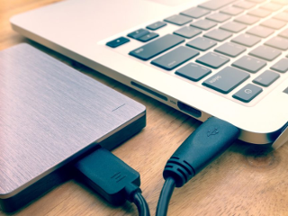

# Borgbahm
[](https://www.gnu.org/licenses/gpl-3.0)

Borgbahm is a program that uses BORG for BAcking up the HoMe directory. With it you can conveniently create and
restore backups of the `/home` directory on an external drive with Borg backup.

Borgbahm was developed for the specific use case where you have a GNU/Linux server or workstation and you would like
to automate the creation of daily backups of everything in the `/home` directory.



Program features:

* Automatically manage incremental backups. It keeps a backup archive of the last 7 days, the last 4 weeks and the last
  6 months. 
* Easily restore the most recent backup archive. Typically after a reinstall, migration or hardware upgrade of the 
  system. 
* Automatically mount and unmount the external drive for backup and restore operations. This means that an unwanted or
  accidental operation on your system cannot corrupt your backup data.
* Encrypt your backup data for security purposes. To make sure only you can access your backup
  data.
* Compress your backup data for efficient disk space usage on the external drive.

## Installation

Borgbahm is a single file Python 3 program called `borgbahm.py`. You can copy it to any location you prefer and run
it from there. The recommended approach is to copy it to `/usr/bin` and make sure the program is marked as executable:

* `sudo cp borgbahm.py /usr/bin/borgbahm`
* `sudo chmod +x /usr/bin/borgbahm`

## Dependendies

The package `borgbackup` is needed to run Borgbahm. Here are the installation commands for some popular GNU/Linux
distributions:

* **Debian**: `sudo apt install borgbackup`
* **Ubuntu**: `sudo apt install borgbackup`
* **Fedora**: `sudo dnf install borgbackup`
* **openSUSE**: `sudo zypper install borgbackup`

## Prerequisites

1. Borgbahm creates backups on a partition on an external drive. It was success tested with an EXT4 formatted 
   partition. Before you can use Borgbahm, it is assumed you know the device name of the partition on the
   external drive, for example `/dev/sdc`. When not known, you can use the command `sudo fdisk -l` to identify
   the device name of the partition on the external drive.
   
2. Borgbahm automatically mounts and unmounts the partition on the external drive, therefore a directory on your
   system needs to be present, so it can be used as a mount point. If not yet present, you could create it using
   the command `sudo mkdir /mnt/backup`.

3. Under the hood, Borgbahm uses the Borg backup program. Therefore a Borg backup repository should be available
   on the partition on the external drive. The following commands can be use to temporarily mount the partition
   and then create the Borg backup repository.
   * `sudo mount /dev/sdc /mnt/backup`
   * `sudo borg init --encryption=repokey /mnt/backup/borgrepo`
   * `sudo umount /mnt/backup`
       
Note that when creating the Borg backup repository, you are automatically prompted for a passphrase to protect
the repository via encryption. Store this passphrase at a safe place, as you will need it for creating and restoring
backups.    

### Creating a backup archive

To create a new backup archive, the Borgbahm program is called with super user privileges. It requires four 
parameters: (1) the device name of the partition on the external drive, e.g. `/dev/sdc`, (2) the directory to
mount this partition to, e.g. `/mnt/backup`, (3) the name of the Borg repository on the partition, e.g. `borgrepo`,
and (4) the passphrase for accessing the Borg repository, e.g. `Pa55w0rd`. 

Example:
* `sudo borgbahm /dev/sdc /mnt/backup borgrepo Pa55w0rd`
 
Note that after creating the backup archive, Borgbahm automatically removes backup archives that are no longer
needed. It keeps a backup archive of the last 7 days, the last 4 weeks and the last 6 months. For this reason,
it is recommended to create a backup archive with Borgbahm once a day. This can be automated by creating
a daily CRON job. Example for Debian/Ubuntu based systems:

* Create and edit the file `/etc/cron.d/borgbahmdaily` such that it has the following contents, but update the
  parameters for you situation:
    ```
    # run at 1:23am every day
    23 01 * * * root borgbahm /dev/sdc /mnt/backup borgrepo Pa55w0rd >>/var/log/borgbahmrun
    ```
* Restart the CRON daemon to make sure the new CRON job is active: `sudo systemctl restart cron`.

### Restoring the most recent backup archive

Borgbahm has build-in functionality for conveniently restoring the most recent backup. All you need to do is add
the `--restore` parameter when running Borgbahm. Instead of creating a new backup archive, it will then restore
the files and directories from the most recently created backup archive.

Example:
* `sudo borgbahm --restore /dev/sdc /mnt/backup borgrepo Pa55w0rd`
 
Note that Borgbahm creates normal Borg backup archives. In case you would like to restore files from another
backup archive, instead of the most recent one, you can use all the feature from Borg backup. Refer to the
[Borg backup documentation](https://borgbackup.readthedocs.io/en/stable/quickstart.html) for more info.

### Additional help

For additional details on Borgbahm, run the program with the `--help` parameter:

```
usage: borgbahm.py [-h] [-d] [-r] [-q] device mountdir reponame passphrase

Manage backups of the /home directory with borg. Run this program on a daily
basis to create incremental backups. It automatically maintains 7 daily,
4 weekly and 6 monthly backup archives.

positional arguments:
  device         device name of the backup drive partition, e.g. /dev/sdc.
  mountdir       directory for mounting the device, e.g. /mnt/backup.
  reponame       name of the borg repository on the device, e.g. borgrepo.
  passphrase     passphrase to access the borg repository, e.g. Pa55w0rd.

optional arguments:
  -h, --help     show this help message and exit
  -d, --debug    enable debug messages on the standard output.
  -r, --restore  restore from the most recent archive, instead of backing up.
  -q, --quiet    enable quiet mode for less output.

Example for creating a new backup archive:
	sudo borgbahm.py /dev/sdc /mnt/backup borgrepo Pa55w0rd

Example for restoring from the most recent backup archive:
	sudo borgbahm.py --restore /dev/sdc /mnt/backup borgrepo Pa55w0rd

It is assumed that the 'mountdir' exists and that the 'borgrepo' on the device
is initialized. To initialize a borg repository use:
	sudo borg init --encryption=repokey /mnt/backup/borgrepo

```